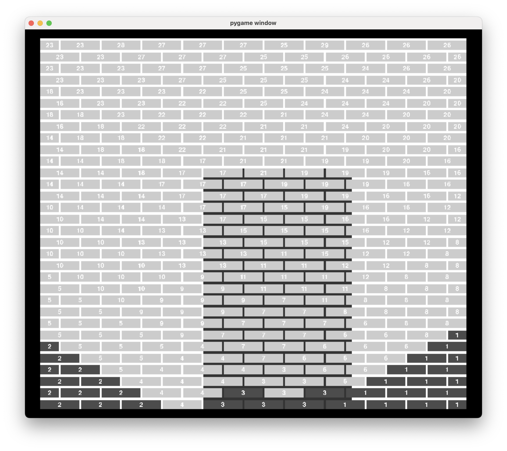

# Bricks

Visualisation of building a masonry wall. Built with pygame. The supported bonds are stretcher bond, English Cross bond, Flemish bond, wild bond.

## How to run

The visualization is a python3 script depending on pygame. If you already have python installed, use the following commands on a unix machine to run the visualization inside a venv.

```shell
python3 -m venv venv
source venv/bin/activate
pip install --upgrade pip
pip install -r requirements.txt
python runme.py
```

This will run the visualization for stretcher bond for a 2300mm wide by 2000mm in height wall (basic requirements). It will look like this.



Press `enter` to lay a brick. Press `backspace` to remove the latest brick. Bricks have stride numbers of them. The dark gray rectangle behind the bricks represents the current envelope — 800mm wide and 1300mm high area within which the machine can reach the bricks.

## Other bonds

By default the config for the visualization is read from the file `stretcher_bond.wallconfig`. You can change the input file for the config with the `--wallconfig` option. Example:

```shell
python runme.py --wallconfig flemish_bond.wallconfig
```

There are 4 pre-made configuration files (1 for each supported bond).

## Advanced running options

The visualization works in 3 steps:

1. Generate the brick pattern
2. Generate the steps to lay the pattern
3. Visualize

It is possible to produce artifacts on steps 1 and 2 and load them into the visualization instead of generating the brick pattern and the steps from scratch every time. This is useful if you want to debug a specific case of a generated wild bond pattern or save these annoying seconds on generating the bricklaying steps.

To do so, run the steps separately. Using `--mode` option to choose the step and `--brickpattern` and `--bricksteps` options to pass the generated pattern and steps files.

Example step 1:
```shell
python runme.py --wallconfig wild_bond.wallconfig --mode pattern > pattern.txt
```

Example step 2:
```shell
python runme.py --wallconfig wild_bond.wallconfig  --brickpattern pattern.txt --mode steps > steps.txt
```

Example step 3:
```shell
python runme.py --wallconfig wild_bond.wallconfig --brickpattern pattern.txt --bricksteps steps.txt
```

## Notes on wild bond

It looks like there are several flavors of wild bond. My algorithm implements the following restrictions:

1. The even and odd courses are shifted by 1/4 of a brick relative to each other. It is achived by using a drieklezoor brick in the beginning of odd courses (numbered from 0) and a drieklezoor brick in the end of even courses. The rest of the bricks in the wall are full bricks and half bricks.
2. Full bricks and half bricks are mixed randomly.
3. No two half bricks next to each other, either horizontally (in the same course) or vertically (in the different courses)
4. No more than 5 staggered steps.
    4.1 A "left" staggered steps of length $n$ is defined as a sequence of bricks $b_1, b_2, ..., b_n$ such than they are located in courses $k, k+1, ..., k + n - 1$ and the brick $b_{i - 1}$ is shifted to a distance of a quater brick to left relative to the brick $b_i$, i. e. $x_{i - 1} + joint - x_i = -q$. Trivia: one brick forms a staggered steps of len 1.
    4.2 A "right" staggered step of length $n$ is defined as a sequence of bricks $b_1, b_2, ..., b_n$ such than they are located in courses $k, k+1, ..., k + n - 1$ and the brick $b_{i - 1}$ is shifted to a distance of a quater brick to right relative to the brick $b_i$, i. e. $x_{i - 1} - joint - x_i = q$.
    4.3 A staggered steps is either a left staggered steps of a right staggered steps.

## Notes on implementation

### Brick laying steps generation

My algorimthm for choosing the order of laying bricks is the same for all bonds.

For each stride I iterate through the $x$ coordinates of the bricks in the bottom 3 courses that contain unlayed bricks and try to place the envelope at one of this positions. The y coordinate of the envelope is chosen as the coordinate of the bottom course with unlayed bricks. I choose the position of the envelope in which I would lay the most bricks. This is the position of the envelope for this stride. I repeat until all the bricks are layed.

### Wild bond pattern generation

The pattern for wild bond is generated brick by brick. I generate options for the next brick: full brick if possible (i. e. doesn't create staggered steps) and half brick if possible (i. e. doesn't create staggered steps and isn't adjacent to an already layed half brick). If the list of options is empty, I go 5 bricks back and generate them again. If this doesn't help, I regenerate from the previous course.